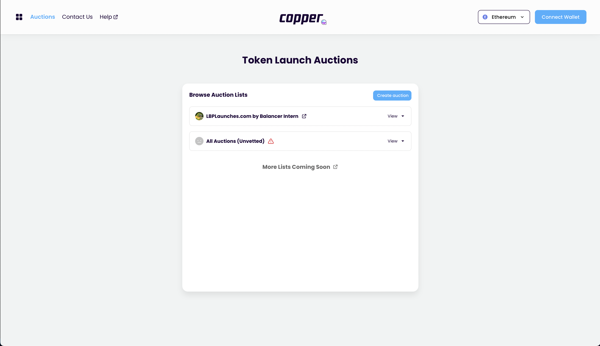
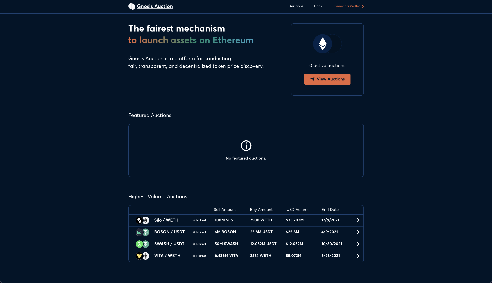

# Auction discovery page

## Purpose

The purpose of the auction discovery page is to allow users to discover auctions and start auctions.

## Users

- Investor
  - Potential auction participant
- Issuer
  - Auction creator/manager

## User flows

- [Investor discovers vetted auction](../../user_flows/discover_vetted_auction.md)
- [Investor discovers unvetted auction](../../user_flows/discover_unvetted_auction.md)

## User needs

| User     | User Wants                               | Product Needs                                     |
| -------- | ---------------------------------------- | ------------------------------------------------- |
| Investor | Wants to find auctions to participate in | Needs to display auctions in an intuitive fashion |
| Issuer   | Wants to start an auction                | Needs allow a user to start an auction            |

## Features

### [Auction lists](stages/auction_list.md)

### Create auction button

- Links to [create auction page](../../pages/create_auction_page)

## Examples

### Copper Launch

### Gnosis Auction

