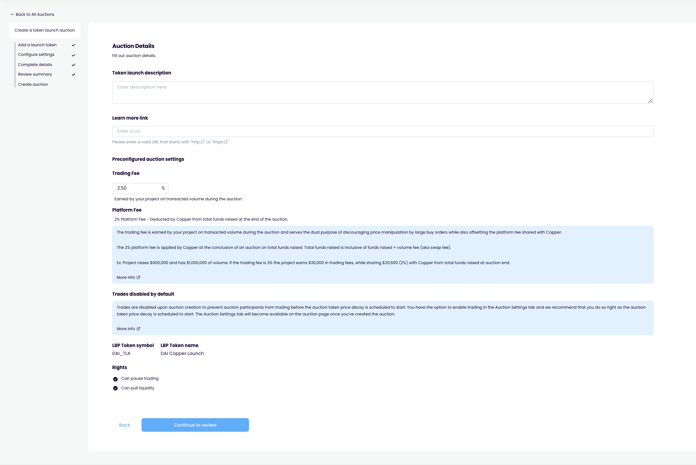

# Auction config

## Purpose

The purpose of the auction config step is to allow the user to supply all the auction config details.

## Implementation

Auction config is a step in the auction creation page which contains sub-steps.

## Sub steps

### Step 1: Start and end

**inputs**

- Start date
- End date

**display**

- Auction duration
- Bond maturity date

### Step 2: Bidding

**inputs**

- Minimum bid size
- Last date to cancel bid (must be in between start/end date)

**display**

### Step 3: Auction type

**inputs**

- Type (private/public)
- if private
  - Signer address

**display**

- Link to docs explaining how signer works
- Tooltip saying addresses can be added to whitelist later
- Tooltip saying not to use an address with assets in it (need clarity on this)

### Step 4: Auction information

**inputs**

- Issuer
- Auction description
- Prospectus link

**display**

- Link to docs explaining what a prospectus is
- Platform fee

### Step 5: Auction config review

**display**

- Start and end
  - Start date
  - End date
  - Duration
  - Bond maturity date
- Bidding
  - Minimum bid size
  - Last date to cancel bid (must be in between start/end date)
- Auction type
  - Type
  - if private
    - Signer address
- Auction information
  - Issuer
  - Auction description
  - Prospectus link
  - Platform fee

## Examples

### Copper Launch

Contract information

Auction config

Review

