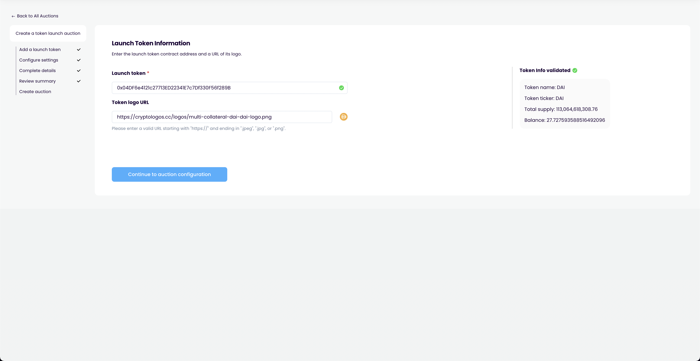
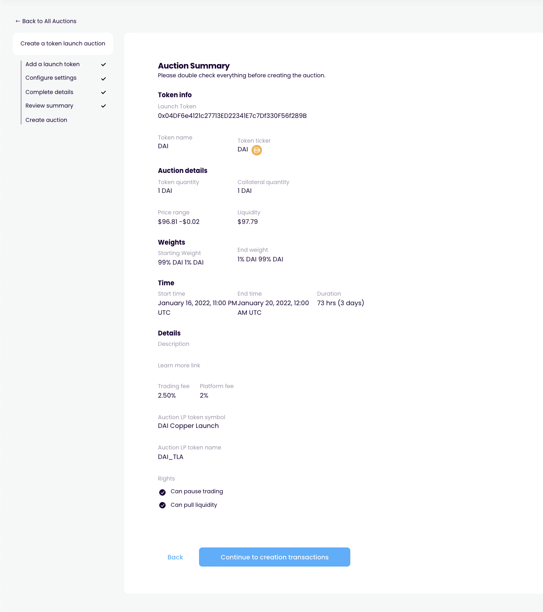

# Bond config

## Purpose

The purpose of the bond config step is to allow the user to supply all the bond config details.

## Implementation

Bond config is a step in the auction creation page which contains sub-steps.

## Sub steps

### Step 1: Bond

**inputs**

- Bond asset contract address
- Max interest rate
- Term length
- Maximum issuance size
- Minimum issuance size

**display**

- Bond asset logo
- Bond asset name
- Bond asset ticker
- Bond asset balance

### Step 2: Collateral

**inputs**

- Collateral (yes/no)
  - if yes
    - Collateral asset contract address
    - Collateral asset amount/ratio (can switch between)

**display**

- Link to docs explaining how collateral works
- if collateral
  - Collateral asset logo
  - Collateral asset name
  - Collateral asset ticker
  - Collateral asset balance
  - Collateral asset price (in terms of bond asset)
  - Current value of collateral (in terms of bond asset)

### Step 3: Convertibility

If there is no collateral, the bond cannot be convertible. Display a message explaining this and disable inputs if there is no collateral.

**inputs**

- Convertible (yes/no)
  - if yes
    - Convertible asset amount (must be lower than or equal to bond collateral asset amount)

**display**

- Link to docs explaining how convertibility works
- if convertible
  - Breakeven token price of convertibility (in terms of bond asset)
  - Link to docs explaining breakeven token price

### Step 4: Bond config review

**display**

- Bond
  - Bond asset contract address
  - Bond asset logo
  - Bond asset name
  - Bond asset ticker
  - Max interest rate
  - Term length
  - Maximum issuance size
  - Minimum issuance size
- Collateral
  - if yes
    - Collateral asset contract address
    - Collateral asset logo
    - Collateral asset name
    - Collateral asset ticker
    - Collateral asset amount
    - Collateral asset ratio
    - Collateral asset price (in terms of bond asset)
    - Current value of collateral (in terms of bond asset)
  - if no
    - None
- Convertible
  - if yes
    - Convertible asset amount
    - Breakeven token price of convertibility (in terms of bond asset)
  - if no
    - No

## Examples

### Copper Launch

Contract information

Review

