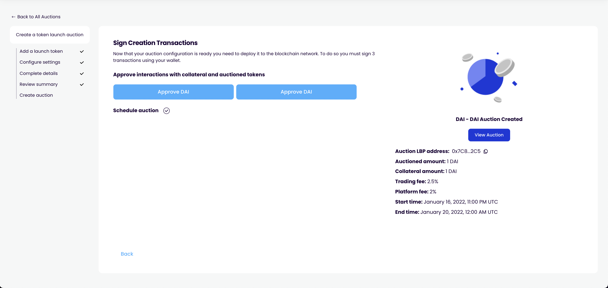

# Create auction

## Purpose

The purpose of the create auction step is to allow the user to submit all the transactions necessary to create the auction.

## Implementation

Create action is the last step in the auction creation page which uses buttons + loading modals to aid user in scheduling the auction.

**inputs**

- Approve collateral access button
- Schedule auction button

**display**

- View auction button (once completed)

## Examples

### Copper Launch

