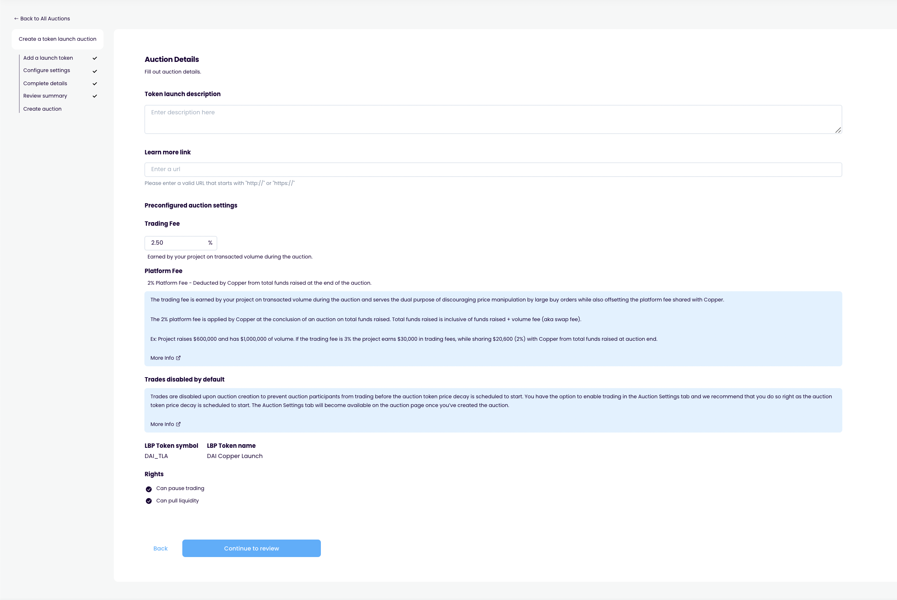

# Review summary

## Purpose

The purpose of the review summary step is to allow the user to review all the data they've entered and confirm everything is correct.

## Implementation

Review summary is a step in the auction creation page which lists information about the bonds and auction.

**display**

- Bond config
  - Bond
    - Bond asset contract address
    - Bond asset logo
    - Bond asset name
    - Bond asset ticker
    - Max interest rate
    - Term length
    - Maximum issuance size
    - Minimum issuance size
  - Collateral
    - if yes
      - Collateral asset contract address
      - Collateral asset logo
      - Collateral asset name
      - Collateral asset ticker
      - Collateral asset amount
      - Collateral asset ratio
      - Collateral asset price (in terms of bond asset)
      - Current value of collateral (in terms of bond asset)
    - if no
      - None
  - Convertible
    - if yes
      - Convertible asset amount
      - Breakeven token price of convertibility (in terms of bond asset)
    - if no
      - No
- Auction config
  - Start and end
    - Start date
    - End date
    - Duration
    - Bond maturity date
  - Bidding
    - Minimum bid size
    - Last date to cancel bid (must be in between start/end date)
  - Auction type
    - Type
    - if private
      - Signer address
  - Auction information
    - Issuer
    - Auction description
    - Prospectus link
    - Platform fee

## Examples

### Copper Launch

Contract information

Auction config

Review

