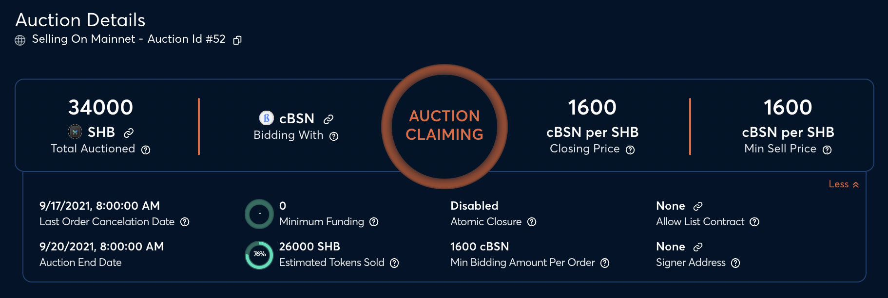
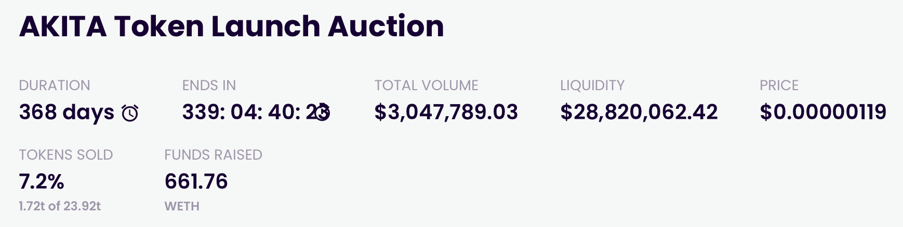

# Auction information

## Purpose

The purpose of auction information is to display to the user necessary information regarding the current state of the auction. Some information displayed will change depending on the current state of the auction while others will always be displayed.

## States

- Upcoming
  - Auction has not started
- Active
  - Auction is ongoing
- Ended
  - Auction has ended

## Implementation

The auction information will be displayed at the top of the page in a grid.

### Information to display

#### Issuer

- Description: The name of the issuing organization provided by auction creator
- Value: string
  - Ex: Uniswap

#### Status

- Description: Current status of the auction
- Value
  - Enum
    - Upcoming
    - Active
    - Ended

#### Duration

- Description: Scheduled length of the auction
- Value: days
  - Ex: 7 days

#### Starts in (Upcoming only)

- Description: Time until auction starts
- Value: days and hours
  - Ex: 7 days, 3 hours

#### Ends in (Active only)

- Description: Time until auction ends
- Value: days:hours:minutes:seconds
  - Ex: 1: 03: 20: 58

#### Ended (Ended only)

- Description: Date when auction ended
- Value: date
  - Ex: Jan 21, 2022

#### Bond offering size

- Description: Maximum amount and type of token DAO will borrow
- Value: amount and type of asset
  - Ex: 50M FEI

#### Total bid volume

- Description: Sum of all bids submitted in auction
- Value: amount and type of asset
  - Ex: 75M FEI

#### Minimum funding threshold

- Description: Bid volume required for auction to settle
- Value: amount and type of asset
- Ex: 30M FEI

#### Current auction interest rate (Active only)

- Description: The interest rate that would be set if the auction were to end with no more bids being submitted.
- Value: percent
  - Ex: 8%

#### Clearing auction interest rate (Ended only)

- Description: The interest rate that was set for the auction.
- Value: percent
  - Ex: 8%

#### Maximum interest rate

- Description: The auction determines interest rate based on supply and demand. This is the maximum interest rate the issuer is willing to pay.
- Value: percent
  - Ex: 15%

## Examples

### Gnosis Auction

### Copper Launch

