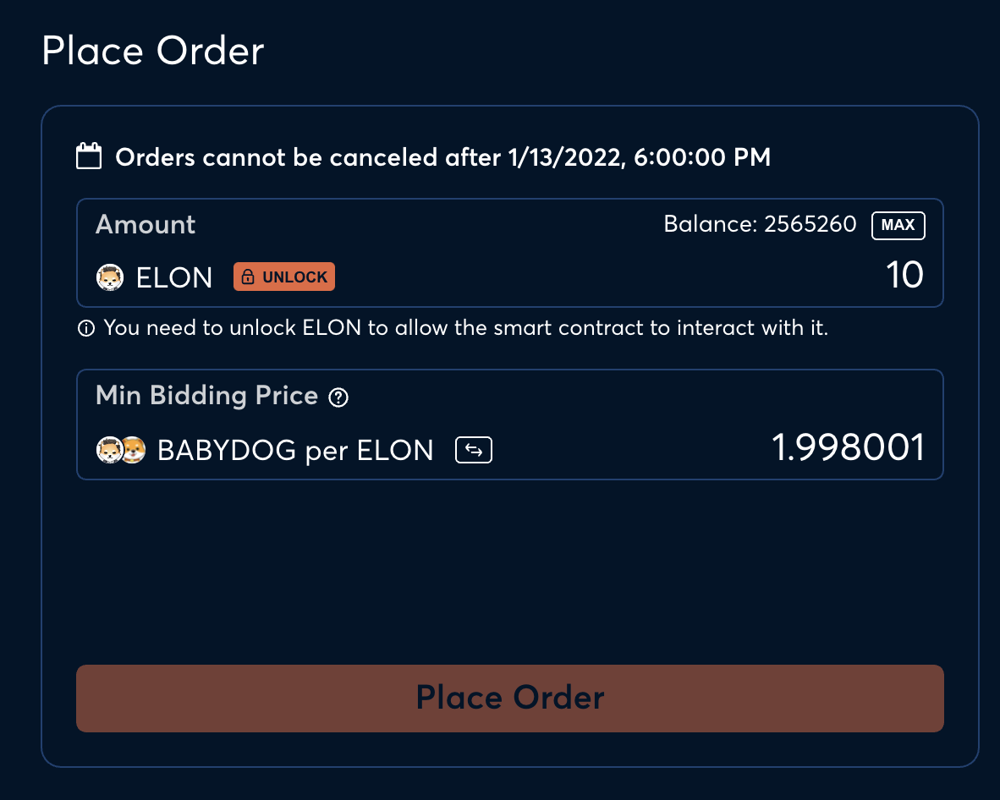
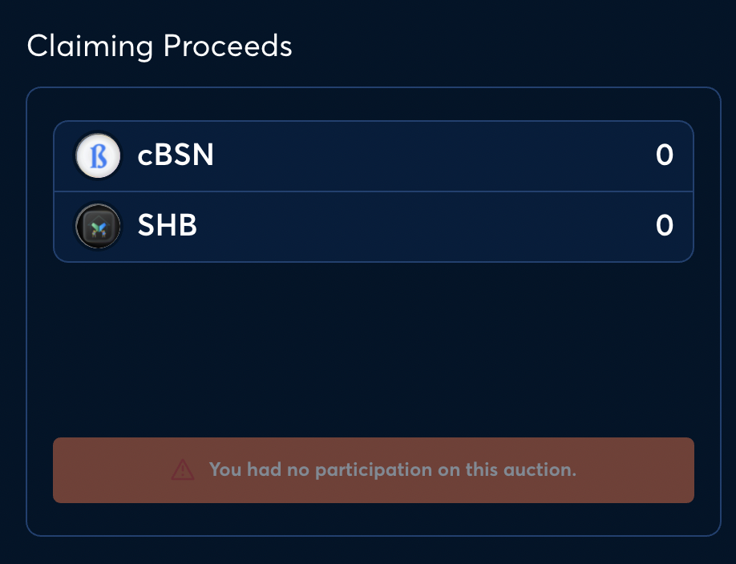

# Order panel

## Purpose

The purpose of the order panel is to allow users to submit bids to the auction. If the auction has a whitelist, only whitelisted addresses will be able to participate.

## States

- Upcoming
  - Auction has not started
- Active
  - Auction is ongoing
- Ended
  - Auction has ended

## Implementation

The order panel will have a different implementation and purpose depending on the state of the auction.

### Upcoming

Empty state declaring the auction hasn't started yet.

### Active

Inputs allowing a bid to be placed.

#### **Information**

- Balance
  - Description: Amount of bidding asset in connected wallet
  - Value: number
    - Ex: 750,000
- Order cancellation cutoff date
  - Description: The date after which an order cannot be cancelled
  - Value: date and time
    - Ex: Jan 14, 2022 12:00 UTC

#### **Inputs**

- Amount
  - Description: Size of bid
  - Value: amount and type of asset
    - Ex: 750,000 FEI
- Interest rate
  - Description: Interest rate for bid
  - Value: percent
    - Ex: 12%
- Price
  - Description: Price for bid
  - Value: amount and type of asset
    - Ex: 0.875 FEI

Important detail: Interest rate and price should be one input that can have its units switched between. The interest rate can be calculated from the price and vice versa. Therefore, you only need one of the values to get both.

### Ended

Information and button allowing user to claim bonds and funds.

(This functionality could alternatively be handled in [User Orders](user_orders.md))

#### **Information**

- Unfilled bid funds
  - Description: Funds leftover from unfilled and/or partially filled bids
  - Value: number and type of asset
    - Ex: 750,000 FEI
- Bonds purchased
  - Description: The number of bonds successfully purchased
  - Value: number
    - Ex: 200,000

#### **Inputs**

- Claim funds
  - Description: Button to claim unfilled bid funds and bonds

## Examples

### Gnosis Auction

**Active state**

**Ended state**

