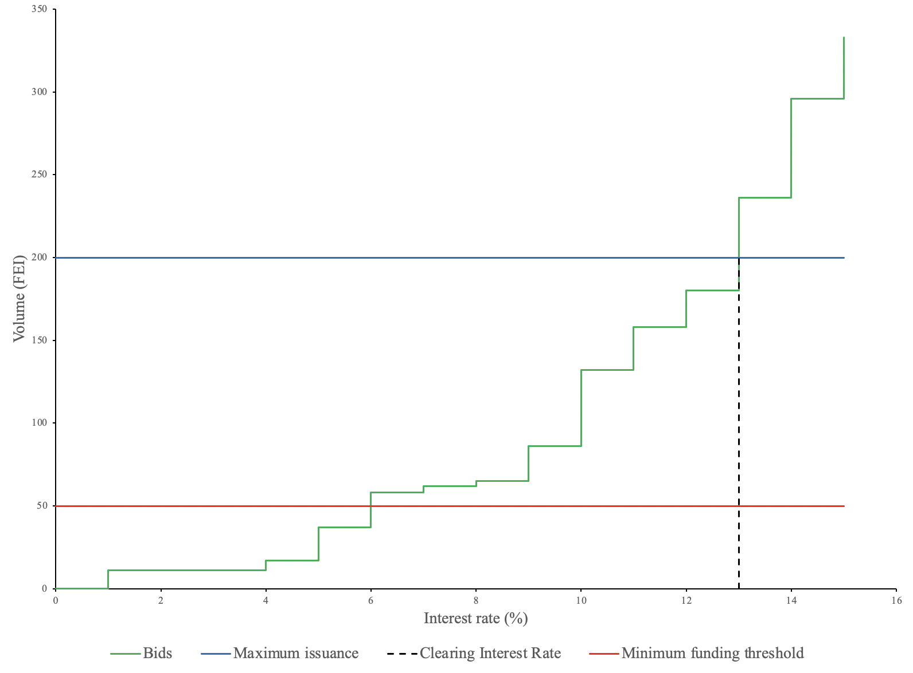
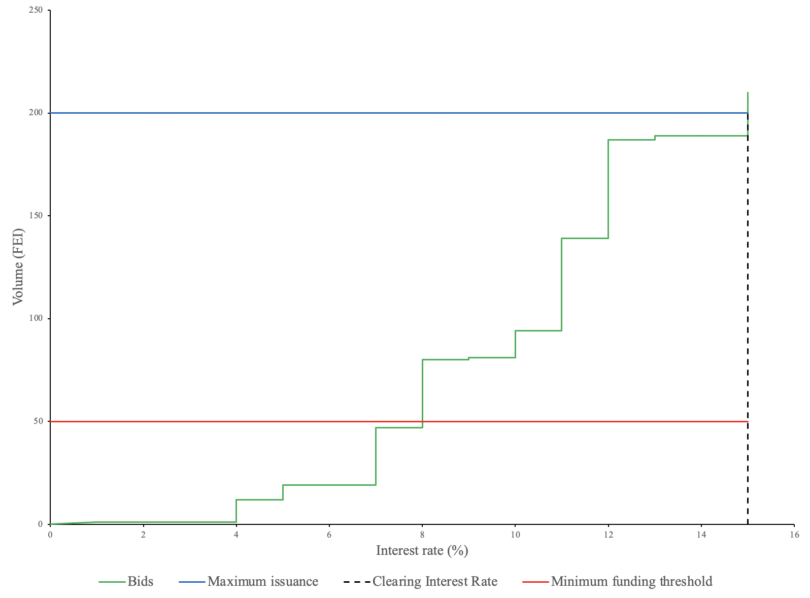

# Orderbook graph

## Purpose

The purpose of the orderbook graph is to visually communicate the state of the auction.

## States

- Upcoming
  - Auction has not started
- Active
  - Auction is ongoing
- Ended
  - Auction has ended

## Implementation

The orderbook graph will be a graph with each line representing a different piece of auction information.

### Lines

#### Bids

- Description: This line shows how much bid volume exists at each interest rate. It represents the demand curve.

#### Maximum issuance

- Description: This line shows the maximum issuance which is the maximum amount the issuer will borrow. It represents the supply curve.

#### Minimum funding threshold/minimum issuance

- Description: This line shows the minimum amount of bid volume required for the auction to settle.

#### Clearing interest rate

- Description: This line shows what the interest rate would be set at if the auction ended at the current state.

## Examples

### Gnosis Auction

### Microsoft Excel

