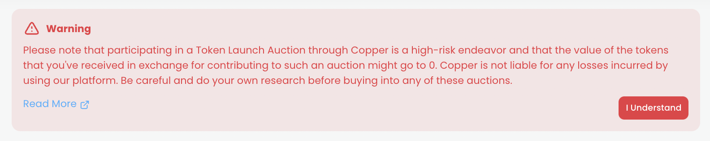

# Warning

## Purpose

The purpose of the warning is to alert investors of the large amount of risk they are taking if they participate in a bond offering and inform them that Porter is not responsible for any loss of funds.

## States

- Upcoming
  - Auction has not started
- Active
  - Auction is ongoing
- Ended
  - Auction has ended
  - (Does not appear in this state)

## Implementation

The warning will display a paragraph of text and will be dismissable by a button. It also links to auction documentation.

## Example

### Copper Launch

