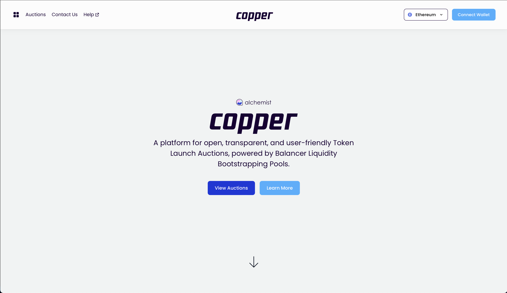
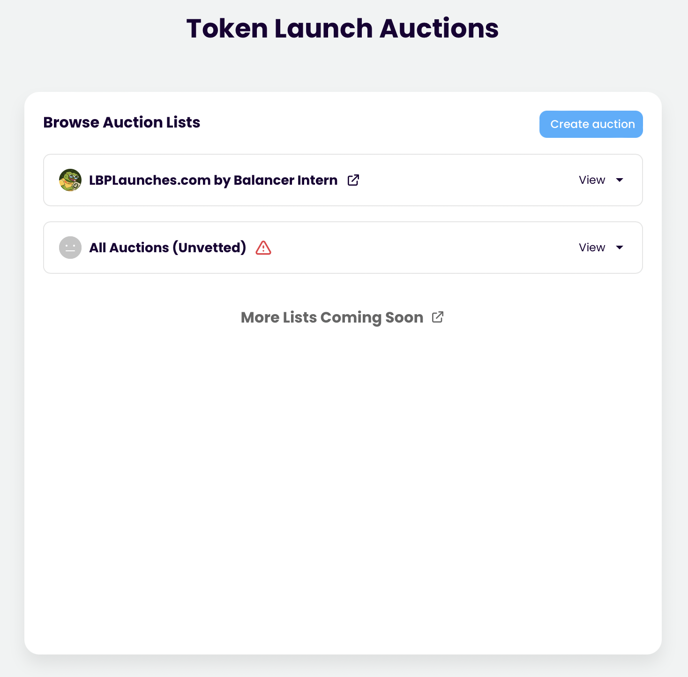
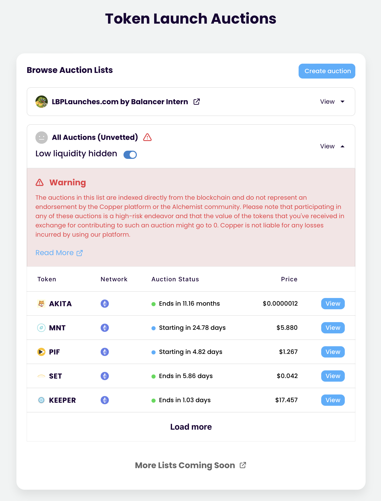

# Discover unvetted auction

## Inspiration

[Copper Launch](https://copperlaunch.com)

## User flow

1. User starts on landing page
   
2. User clicks "view auctions" call to action
3. User navigates to auction discovery page
   
4. User sees auction lists created by vetted 3rd parties and an unvetted list which has a warning icon
   
5. User click on unvetted auction list
6. User sees a warning explaining the list contains auctions that are unvetted and risky
7. User sees list of unvetted auctions and details on each auction
   
8. User selects auction to navigate to its page
