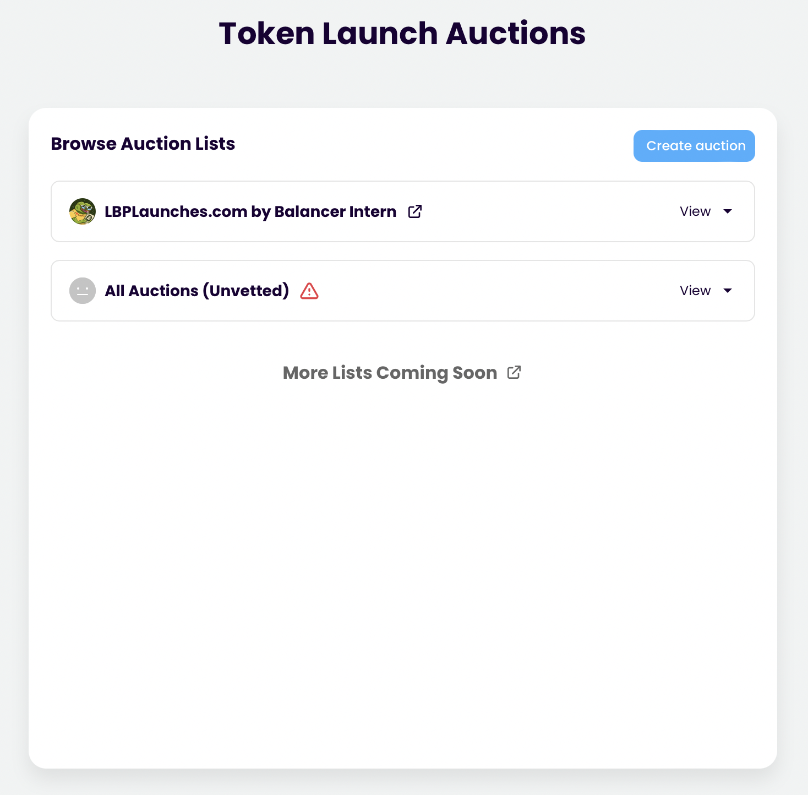

# Discover vetted auction

## Inspiration

[Copper Launch](https://copperlaunch.com)

## User flow

1. User starts on landing page
   
2. User clicks "view auctions" call to action
3. User navigates to auction discovery page
   
4. User sees auction lists created by vetted 3rd parties and an unvetted list
   
5. User clicks on 3rd party auction list which opens up a dropdown to their vetted auctions
   
6. User selects auction to navigate to its page
