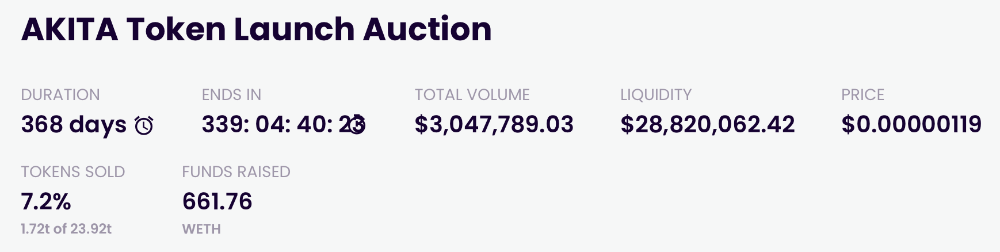

# Submits an order

## Inspiration

- [Copper Launch](https://docs.alchemist.wtf/copper/auction-participation-walkthrough)
- [Gnosis Auction](https://gnosis-auction.eth.link/#/start)
  - Go to docs
  - Click "Participate as a bidder"

## User flow

1. User starts on an auction page with an "Active" status
   
2. User sees warning outlining the dangers of participating in bond auctions
   
3. User sees auction details
   
   
4. User sees chart representing order book
   
5. User sees bond details
   
6. User sees submit bid panel
   
7. User submits a bid by entering volume and interest rate (or price)
8. A modal appears which shows bid transactions
9. User confirms a transaction giving Porter authorization to access their funds
10. User confirms a transaction to send funds and submit the bid
11. Loading spinner appears until transactions are complete
    
12. Happy state is shown once transactions are complete
13. Bid shows up in "your orders" section
    
