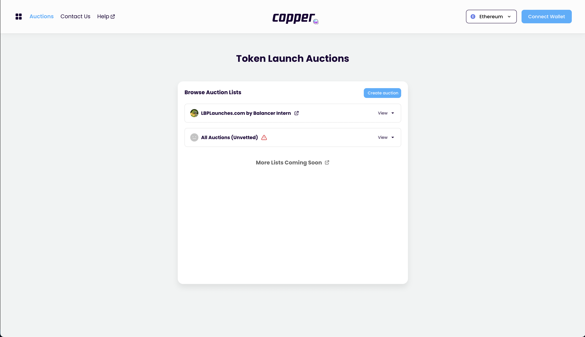

# Start auction

## Inspirations

- [Copper Launch](https://docs.alchemist.wtf/copper/fair-launch-auctions/auction-creation)
- [Gnosis Auction](https://gnosis-auction.eth.link/#/start)
  - Go to docs
  - Click "Start an auction via UI"

1. User starts on the auction discovery page
   
2. User clicks "create auction" call to action
3. User navigates to auction creation page
   
4. User enters [configuration for bond](../inputs/bond_config.md)
5. User enters [configuration for auction](../inputs/auction_config.md)
6. User reviews auction details
7. User creates auction
8. Sign creation transactions

- Approve collateral spend
- Send collateral
- Schedule auction
