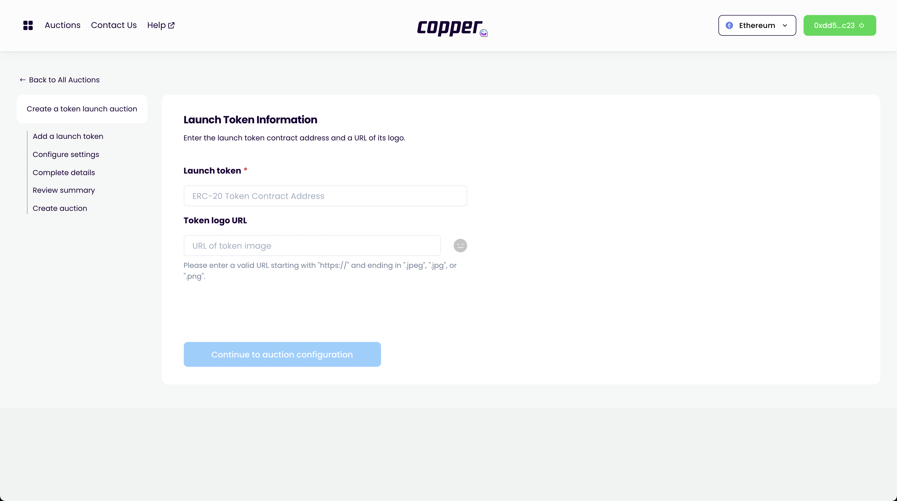
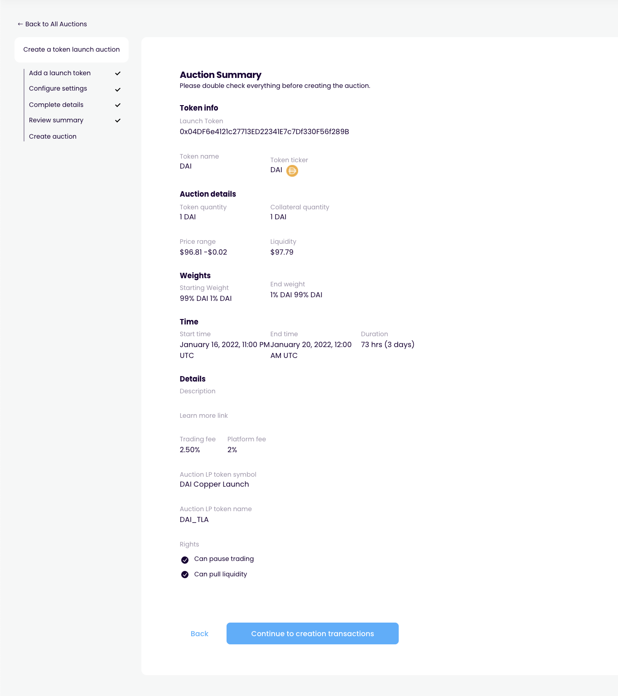

# Start auction

## Inspirations

- [Copper Launch](https://docs.alchemist.wtf/copper/fair-launch-auctions/auction-creation)
- [Gnosis Auction](https://gnosis-auction.eth.link/#/start)
  - Go to docs
  - Click "Start an auction via UI"

## User flow

1. User starts on the [auction discovery page](../pages/auction_discovery_page)
   
2. User clicks "create auction" call to action
3. User navigates to [auction creation page](../pages/create_auction_page)
   
4. User enters [configuration for bond](../pages/create_auction_page/features/bond_config.md) and clicks "next"
5. User enters [configuration for auction](../pages/create_auction_page/features/auction_config.md) and clicks "next"
6. User reviews auction details on the [review summary stage](../pages/create_auction_page/features/review_summary.md)
   
7. User creates auction on the [create auction stage](../pages/create_auction_page/features/create_auction.md)
   
8. User clicks link to go to created auction which brings them to their [auction page](../pages/auction_page)
